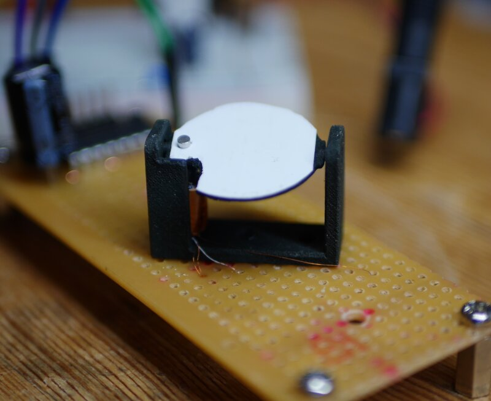

# flipdot

DiY Electromechanical Display

A DiY electromechanical "Flip-Dot" matrix 
display using 3D-printed components.

## Flipdot Assembly

The flipdot mechanism is 3D printed from a freecad model:

 - flipdot.FCStd : FreeCAD model for 3D printing
 - flipdot_body.stl : Mounting frame for flip-dot
 - flipdot_pixel.stl : Flip pixel

A small permanent magnet in the pixel is rotated as required by
pulsing a solenoid wound over a steel screw.

Wind about 500 turns of #42 guitar pickup wire as a pair onto
an M3x8mm screw, then join the end of one wire to the start of the
other. The join becomes a centre tap, which is connected to the positive
voltage rail. The desired set or clear movement is triggered by
shorting the desired coil to ground through a low-side switch
or darlington driver.

## 4x5 Modular Panel

Each pixel in a 4x5 array has a pair of low-side drivers connected
to 2 bits in a 40-bit shift register. Data is shifted into the display
and latched to energise the chosen coils:

 - flippnlr.pro : Kicad schematic and PCB

Panels are designed to be daisy-chained to build up a larger panel.

TBA
